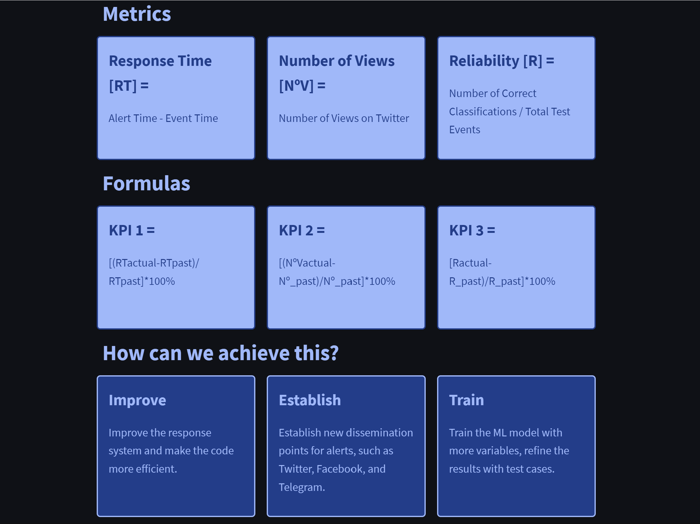
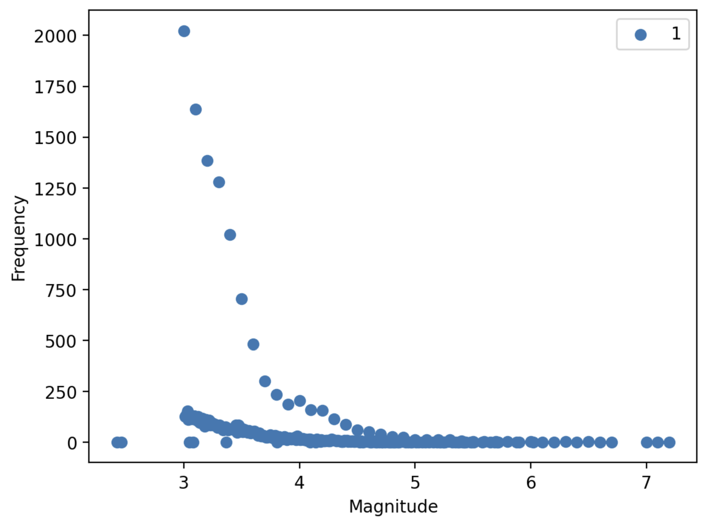

<h1 align=center>---------------------------------------------------------------------</h1>
<h1 align=center id="sistema">Seismic Alert System</h1>
<h1 align=center>---------------------------------------------------------------------</h1>

<h2> Index:</h2>

<a href="#introduction">1. Introduction</a>

<a href="#objectives">2. Objectives</a>

<a href="#project">3. Project Development</a>

<a href="#team">4. Connect with Me</a>

<h1 align=center id="introduction">1. Introduction</h1>

<h2>Streamlit</h2>

Take a look at our <a href="https://jpip8-sistema-de-aler-dataanalyticsstreamlitintroduction-d6ak17.streamlit.app/Conclusion" target="_blank">StreamLit</a> interactive dashboard.

<h2>Quantum Analytics</h2>

Hello there, my name is Juan Pablo Idrovo. As a data analyst at Quantum Analytics, my role involves extracting valuable insights from seismic data using advanced analytical techniques. I process and analyze large datasets to identify patterns, anomalies, and trends in seismic activity. By collaborating with my team, we develop predictive models and provide actionable recommendations for risk assessment and mitigation strategies. I effectively communicate our findings, thereby contributing to public safety and informing stakeholders about seismic hazards.

Go back to <a href="#sistema">top</a>

<h1 align=center id="objectives">2. Objectives</h1>

<h2>KPIs</h2>
<ul>
  <li>KPI: Alert Response Time:
    
This measures the time it takes for the alert system to notify the people after an earthquake event occurs. This KPI helps assess the speed and efficiency of your alert.
</li>
  <li>KPI: Alert Reach:
    
Assess the percentage of the population reached by the alerts. This KPI provides insights into the coverage and penetration of the alert system and helps identify areas or demographic groups that may need additional attention.
</li>
  <li>KPI: Impact Assesment:
    
Assess the impact of earthquakes by analyzing their relationships with secondary events, such as tsunamis and volcanic hazards. This KPI can provide insights into the potential consequences. Increase accuracy and clasification quality.
</li>
</ul>

All KPIs will be measured annually.

Go back to <a href="#sistema">top</a>

<h1 align=center id="project">3. Visualization</h1>

Leveraging the powerful capabilities of streamlit as our core visualization tool, we have successfully generated a series of comprehensive and insightful graphs that shed light on the intricate nature of seismic activity in Japan, Chile, and the United States. These meticulously crafted visual representations serve as pivotal instruments in unraveling the complex dynamics of seismic movements, enabling us to discern patterns, trends, and potential risks with enhanced clarity. Our diligent efforts in harnessing the potential of streamlit have unlocked a wealth of previously inaccessible data, empowering us to conduct a thorough analysis of seismic phenomena. We cordially invite you to embark on an immersive journey through our detailed documentation, where we delve into the intricacies of our visualization process and its profound impact on seismic analysis.

<h2>Magnitude-Frequency Relationship</h2>

The frequency axis provides insights into the distribution of earthquakes across different magnitudes. It can help identify patterns or trends in earthquake occurrence, such as the presence of more frequent smaller-magnitude earthquakes or rare, larger-magnitude events. This information is valuable for understanding seismic activity and assessing the relative occurrence rates of different magnitudes.

In this graph we have the data from the United States.

Go back to <a href="#sistema">top</a>

<h1 align=center id="team">4. Connect with Me</h1>

 Data Analyst

Go back to <a href="#sistema">top</a>
  

  
