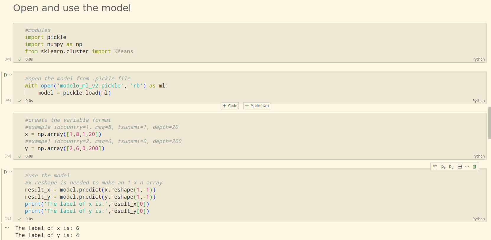
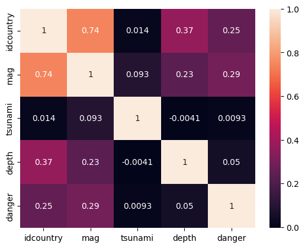

<h1 align=center>Machine Learning</h1>

<h2>Model</h2>

We choose the model called 'Kmeans', it is an unsupervised model based on clustering and. That means the data will be grouped based on features relations, similarities and it does not need correct labeled data to train it. The following picture depict the idea.

<h2>Variables</h2>

Variables have been chosen based on its importance and correlation. they are:

<ul>
<li>idcountry</li>
<li>mag</li>
<li>tsunami</li>
<li>depth</li>
</ul>

We based the selection on the following headmap.

<h2>Clusters 'elbow method'</h2>

A fundamental step for any unsupervised algorithm is to determine the optimal number of clusters into which the data may be clustered. Since we do not have any predefined number of clusters in unsupervised learning. We tend to use some method that can help us decide the best number of clusters.  In the case of K-Means clustering, we use Elbow Method for defining the best number of clustering.  'Elbow graph' 10 clusters have been chosen.

<h2>Open and use the model</h2>

The model is saved already trained as modelo_ml_v2.pickle file, instructions to open and use it are:

<h2>Testing performance</h2>

The test was made using <b>seismicTest.csv</b> file which contains only dangerous events, the model must be able to group the mayority of the events in the clusters 8,6,2,0,7 with the cluster 8 as the most dangerous, every event outside this sets of clusters will be taken as errors.

The relation between model prediction label <b>'danger'</b> and the model variables are:

<ul>
<li>idcountry: 0.25</li>
<li>mag: 0.29</li>
<li>tsunami: 0.0093</li>
<li>depth: 0.05</li>
</ul>

<h2>Conclusions</h2>

As a conclusion the variable tsunami has not been taken with the relevance we thought, it is a point to improve to have a better effectiveness. The model is able to distinguish between dangerous and non-dangerous events but with ambiguity in the middles due to the mapping from 9 groups into 3 groups, a lot of information have been lost on the road. 
