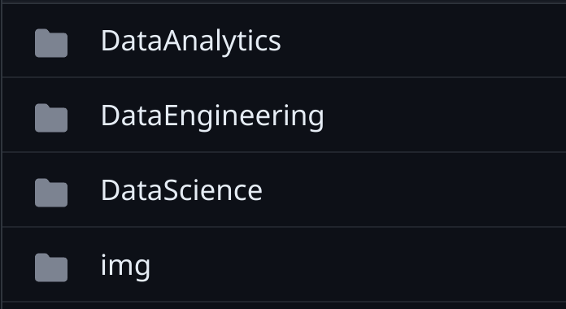
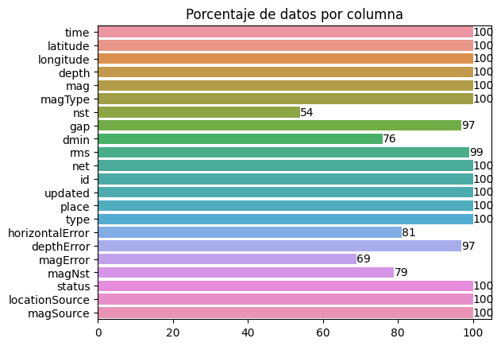
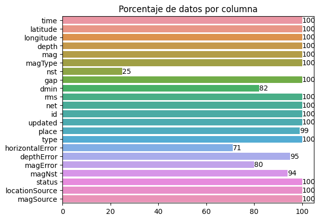
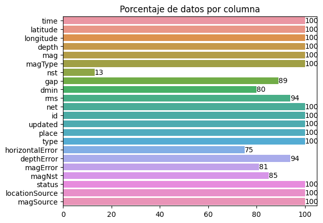

<h1 align=center>Project proposal</h1>
<h1 align=center>Seismic Alert System</h1>

<h2>Understanding of the current situation</h2>

Unpredictable natural events such as earthquakes claim the lives of hundreds of people when they happen, they can even cause other secondary events such as tsunamis, volcano activation, nuclear hazards and after they happen, the structure of the buildings is not known.
Current alerts with numbers or colors do not provide much information about secondary events or the destructiveness of an earthquake.
We face the need to be able to communicate and alert the population of a region about the possibility of natural events, their destructiveness and their consequences.

This team proposes an analysis of the situation of the last years 2018-2023 and an earthquake classification method.

<h2>General Objetives</h2>

<ul>
<li>Expand alert coverage.</li>
<li>Improve the time and type of reaction.</li>
<li>Guarantee accessibility to the alert system.</li>
<li>Deliver a quality system.</li>
</ul>

<h2>Project Scope</h2>

The scope of the project will be for the countries: Chile, United States and Japan. Data from their respective observatories will be used. The use of external data or data from other countries to improve the model is not ruled out. The model will be of classification.

<h2>KPIs</h2>

<ul>
<li>Kpi: Effective coverage percentage --> objective: Expand alert coverage.</li>
<li>Kpi: Average reaction time --> objective: Improve the time and type of reaction.</li>
<li>Kpi: Average number of users per social network platform --> objective: Guarantee accessibility to the alert system.</li>
<li>Kpi: Precision ratio of current alerts --> objective: Increase the precision and therefore the quality of the classification.</li>
</ul>

All kpis will be taken on an annual basis.

<h2>GitHub Repository</h2>

 <a href="https://github.com/jhonvelasque/SISTEMA_DE_ALERTAS_SISMICA"> &nbsp SISTEMA_DE_ALERTAS_SISMICAS</a>

The repository will be organized in folders for each work area. And also a /img folder to orderly store the images of the reports for each stage.

To collaborate we opted for two methods that github gives us at the choice of the collaborator. 

<li> The fork and pull request system, where everyone works on their personal copy of the original repository in their account and sends the changes every day for the rest to see their progress. 
<li>The system of direct cloning of the original repository to work in a branch with its name and see the progress from its branch, when finishing the work the branch will be merged to the main branch.

<h2>Proposed solution</h2>

The proposed solution is an alert API that can be implemented in different social networks and mobile applications, to achieve this the following tasks are proposed.

<li>Data engineering: Data will be extracted from different sources, transformed and stored in the Amazon AWS cloud.

<li>Data analytics: The stored data will be used to show the current situation with an interactive dashboard.

<li>Data science: An earthquake classification model will be created with a machine learning model.

<h2>Work Team</h2>

 Data Engineering

 Data Engineering

 Data Analyst

 Data Science

 Data Science

The system of managers by area and assistants will be used if help is needed.

<h2>Technologic Stack</h2>

<h3>Planning and Collaboration</h3>

 &nbsp Notion

 &nbsp Discord

 &nbsp Whatsapp

 &nbsp GitHub

<h3>Data Engineering</h3>

 &nbsp Python

 &nbsp Numpy

 &nbsp Seaborn

 &nbsp Amazon AWS

<h3>Data Analytics</h3>

 &nbsp Seaborn

 &nbsp Matplotlib

 &nbsp PowerBI

<h3>Data Science</h3>

 &nbsp Python

 &nbsp Sklearn

 &nbsp FastAPI

 &nbsp Render

<h2>Data Quality</h2>

The data will be extracted from the following sources: 

<li>EEUU: &nbsp <a href='https://earthquake.usgs.gov/fdsnws/event/1/query?format=csv&starttime=2012-01-01%2000:00:00&endtime=2022-12-31%2023:59:59&maxlatitude=50&minlatitude=24.6&maxlongitude=-65&minlongitude=-125&minmagnitude=3&orderby=time-asc'>earthquake.usgs.gov/usa </a>

<li>Japan: &nbsp <a href='https://earthquake.usgs.gov/fdsnws/event/1/query?format=csv&starttime=2012-01-01%2000:00:00&endtime=2022-12-31%2023:59:59&minlatitude=27.000000&maxlatitude=44.000000&minlongitude=132.780000&maxlongitude=145.530000&&minmagnitude=3&orderby=time-asc'>earthquake.usgs.gov/japan </a>

<li>Chile: &nbsp <a href='https://earthquake.usgs.gov/fdsnws/event/1/query?format=csv&starttime=2012-01-01%2000:00:00&endtime=2022-12-31%2023:59:59&minlatitude=-56.800000&maxlatitude=-19.000000&minlongitude=-79.000000&maxlongitude=-69.900000&jsonerror=true'>earthquake.usgs.gov/chile </a>

Map of countries involved.

quantum analytics
