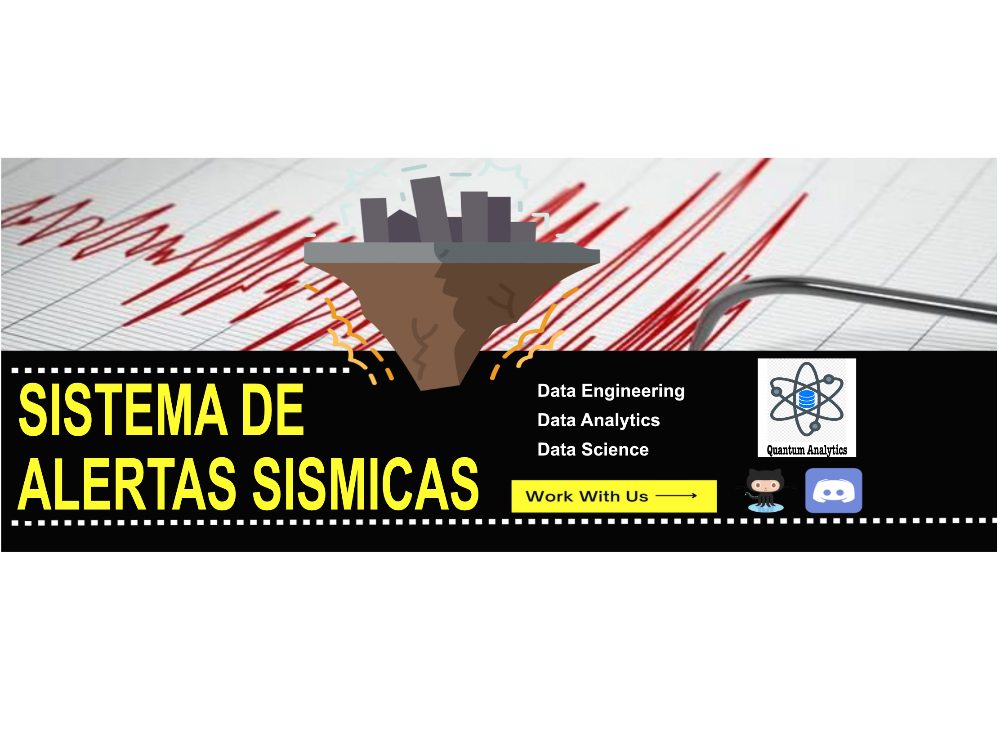

<h1 align=center>--------------------------------------------------------------------------</h1>
<h1 align=center>Sistema de Alertas Sísmicas</h1>
<h1 align=center>--------------------------------------------------------------------------</h1>

<h2> Índice:</h2>

 1. Introducción 
 <a href="https://github.com/JPIP8/SISTEMA_DE_ALERTAS_SISMICA/blob/main/README.md#1-introducci%C3%B3n">
Int
</a> 

 2. Objetivos 

 3. Calidad de datos 

 4. Desarrollo del Proyecto 

 5. Conclusiones y Recomendaciones 

 6. Stack Tecnológico 

 7. Integrantes 

<h1 align=center>1. Introducción</h1>
<h2>Quantum Analytics</h2>

Nosotros somos una consultora llamada Quantum Analytics. A partir de la recolección y análisis de datos de movimientos sísmicos en Estados Unidos, Japón y Chile, nuestra consultora utiliza un modelo de machine learning específico para clasificar los movimientos sísmicos y detectar patrones. Al validar la precisión de nuestro modelo, podemos estar seguros de que proporciona resultados confiables para informar a los ciudadanos sobre posibles peligros sísmicos. Finalmente, comunicamos de manera efectiva estos resultados para que la información llegue a la mayor cantidad de personas posible y contribuir así a la seguridad pública.

<h2>Entendimiento de la situación actual</h2>

Los eventos naturales impredecibles como los sismos se cobran la vidad de cientos de personas cuando suceden, incluso pueden ocasionar otros eventos secundarios como tsunamis, activación de volcanes, peligros nucleares y después que suceden no se conoce como están las estructuras de las edificaciones.
Las alertas actuales con números o colores no brindan mucha información acerca de eventos secundarios o la destructividad de un sismo.
Nos enfrentamos a la necesidad de poder comunicar y alertar a la población de una región, sobre la posibilidad de eventos naturales su destructividad y sus consecuencias.

Este equipo propone un análisis de la situación de los últimos años 2018-2023 y un método de clasificación de sismos.

<h1 align=center>2. Objetivos</h1>
<h2>Alcance</h2>

El alcance del proyecto será para los países: Chile, Estados Unidos y Japón. Se usarán datos de sus respectivos observatorios. No se descarta el uso de datos externos o de otros países para mejorar el modelo. El modelo sera de clasificación.

<h2>KPIs</h2>

<ul>
<li>Kpi: Porcentaje de cobertura efectiva --> objetivo: Ampliar la cobertura de alertas.</li>
<li>Kpi: Promedio de tiempo de reacción --> objetivo: Mejorar el tiempo y tipo de reacción.</li>
<li>Kpi: Promedio de usuarios por plataforma red social --> objetivo: Garantizar la accesibilidad al sistema de alertas.</li>
<li>Kpi: Ratio de presición de alertas actuales --> objetivo: Aumentar la presición por lo tanto la calidad de la clasificación.</li>
</ul>

Todos los kpis serán tomados de manera anual.

<h2>Solución propuesta</h2>

La solución que se propone es una API de alerta que podrá implementarse en distintas redes sociales y aplicaciones móviles, para lograr esto se propone las siguientes tareas.

<li>Data engineering: Se extraerán datos de diferentes fuentes, se transformarán y se almacenarán en la nube de amazon AWS.

<li>Data analytics: Se usarán los datos almacenados para mostrar la situal actual con un dashboard interactivo.

<li>Data science: Se creará un modelo de clasificacián de sismos con un modelo de machine learning.

<h1 align=center>3. Calidad de datos</h1>

Fuente de datos: 

<li>Estados unidos: &nbsp <a href='https://earthquake.usgs.gov/fdsnws/event/1/query?format=csv&starttime=2012-01-01%2000:00:00&endtime=2022-12-31%2023:59:59&maxlatitude=50&minlatitude=24.6&maxlongitude=-65&minlongitude=-125&minmagnitude=3&orderby=time-asc'>earthquake.usgs.gov/usa </a>

<li>Japon: &nbsp <a href='https://earthquake.usgs.gov/fdsnws/event/1/query?format=csv&starttime=2012-01-01%2000:00:00&endtime=2022-12-31%2023:59:59&minlatitude=27.000000&maxlatitude=44.000000&minlongitude=132.780000&maxlongitude=145.530000&&minmagnitude=3&orderby=time-asc'>earthquake.usgs.gov/japan </a>

<li>Chile: &nbsp <a href='https://earthquake.usgs.gov/fdsnws/event/1/query?format=csv&starttime=2012-01-01%2000:00:00&endtime=2022-12-31%2023:59:59&minlatitude=-56.800000&maxlatitude=-19.000000&minlongitude=-79.000000&maxlongitude=-69.900000&jsonerror=true'>earthquake.usgs.gov/chile </a>

Mapa de países involucrados.

<h1 align=center>4. Desarrollo del Proyecto</h1>
<h2>ETL</h2>

Explicar un poco sobre el ETL

Lorem ipsum dolor sit amet, consectetur adipiscing elit. Nullam tincidunt feugiat nulla in luctus. Morbi accumsan dapibus justo, vel facilisis enim fermentum vitae. Cras dignissim bibendum metus ac fringilla. Pellentesque mollis magna viverra viverra faucibus. Pellentesque dictum sodales sapien sit amet maximus. Aliquam metus neque, vehicula at eleifend in, rutrum id turpis. Aenean ac odio efficitur sem lobortis molestie. Etiam mattis ac odio vel dignissim. Sed aliquet ante non erat mollis, eu ornare leo volutpat. Proin ac risus id risus egestas malesuada nec nec lacus.

<h2>EDA</h2>

Explicar un poco sobre el EDA

Lorem ipsum dolor sit amet, consectetur adipiscing elit. Nullam tincidunt feugiat nulla in luctus. Morbi accumsan dapibus justo, vel facilisis enim fermentum vitae. Cras dignissim bibendum metus ac fringilla. Pellentesque mollis magna viverra viverra faucibus. Pellentesque dictum sodales sapien sit amet maximus. Aliquam metus neque, vehicula at eleifend in, rutrum id turpis. Aenean ac odio efficitur sem lobortis molestie. Etiam mattis ac odio vel dignissim. Sed aliquet ante non erat mollis, eu ornare leo volutpat. Proin ac risus id risus egestas malesuada nec nec lacus.

<h2>Modelo de Machine Learning</h2>

Explicar un poco sobre el Modelo de Machine Learning

Lorem ipsum dolor sit amet, consectetur adipiscing elit. Nullam tincidunt feugiat nulla in luctus. Morbi accumsan dapibus justo, vel facilisis enim fermentum vitae. Cras dignissim bibendum metus ac fringilla. Pellentesque mollis magna viverra viverra faucibus. Pellentesque dictum sodales sapien sit amet maximus. Aliquam metus neque, vehicula at eleifend in, rutrum id turpis. Aenean ac odio efficitur sem lobortis molestie. Etiam mattis ac odio vel dignissim. Sed aliquet ante non erat mollis, eu ornare leo volutpat. Proin ac risus id risus egestas malesuada nec nec lacus.

<h2>Visualización</h2>

Explicar un poco sobre la Visualización

Lorem ipsum dolor sit amet, consectetur adipiscing elit. Nullam tincidunt feugiat nulla in luctus. Morbi accumsan dapibus justo, vel facilisis enim fermentum vitae. Cras dignissim bibendum metus ac fringilla. Pellentesque mollis magna viverra viverra faucibus. Pellentesque dictum sodales sapien sit amet maximus. Aliquam metus neque, vehicula at eleifend in, rutrum id turpis. Aenean ac odio efficitur sem lobortis molestie. Etiam mattis ac odio vel dignissim. Sed aliquet ante non erat mollis, eu ornare leo volutpat. Proin ac risus id risus egestas malesuada nec nec lacus.

<h1 align=center>5. Conclusiones y Recomendaciones</h1>

Lorem ipsum dolor sit amet, consectetur adipiscing elit. Nullam tincidunt feugiat nulla in luctus. Morbi accumsan dapibus justo, vel facilisis enim fermentum vitae. Cras dignissim bibendum metus ac fringilla. Pellentesque mollis magna viverra viverra faucibus. Pellentesque dictum sodales sapien sit amet maximus. Aliquam metus neque, vehicula at eleifend in, rutrum id turpis. Aenean ac odio efficitur sem lobortis molestie. Etiam mattis ac odio vel dignissim. Sed aliquet ante non erat mollis, eu ornare leo volutpat. Proin ac risus id risus egestas malesuada nec nec lacus.

Lorem ipsum dolor sit amet, consectetur adipiscing elit. Nullam tincidunt feugiat nulla in luctus. Morbi accumsan dapibus justo, vel facilisis enim fermentum vitae. Cras dignissim bibendum metus ac fringilla. Pellentesque mollis magna viverra viverra faucibus. Pellentesque dictum sodales sapien sit amet maximus. Aliquam metus neque, vehicula at eleifend in, rutrum id turpis. Aenean ac odio efficitur sem lobortis molestie. Etiam mattis ac odio vel dignissim. Sed aliquet ante non erat mollis, eu ornare leo volutpat. Proin ac risus id risus egestas malesuada nec nec lacus.

Lorem ipsum dolor sit amet, consectetur adipiscing elit. Nullam tincidunt feugiat nulla in luctus. Morbi accumsan dapibus justo, vel facilisis enim fermentum vitae. Cras dignissim bibendum metus ac fringilla. Pellentesque mollis magna viverra viverra faucibus. Pellentesque dictum sodales sapien sit amet maximus. Aliquam metus neque, vehicula at eleifend in, rutrum id turpis. Aenean ac odio efficitur sem lobortis molestie. Etiam mattis ac odio vel dignissim. Sed aliquet ante non erat mollis, eu ornare leo volutpat. Proin ac risus id risus egestas malesuada nec nec lacus.

<h1 align=center>6. Stack Tecnológico</h1>

<h3>Planificación y Colaboración</h3>

 &nbsp Notion

 &nbsp Discord

 &nbsp Whatsapp

 &nbsp GitHub

<h3>Data Engineering</h3>

 &nbsp Python

 &nbsp Numpy

 &nbsp Seaborn

 &nbsp Amazon AWS

<h3>Data Analytics</h3>

 &nbsp Seaborn

 &nbsp Matplotlib

 &nbsp PowerBI

<h3>Data Science</h3>

 &nbsp Python

 &nbsp Sklearn

 &nbsp FastAPI

 &nbsp Render

<h1 align=center>7. Integrantes</h1>
<h2>Conecta con Nosotros</h2>

 Data Engineer

 Data Engineer

 Data Analyst

 Data Scientist

 Data Scientist

<h1 align=center>Gracias !</h1>
<h2>Gracias por llegar hasta aquí!</h2>

Esperamos que te haya gustado este proyecto :)

