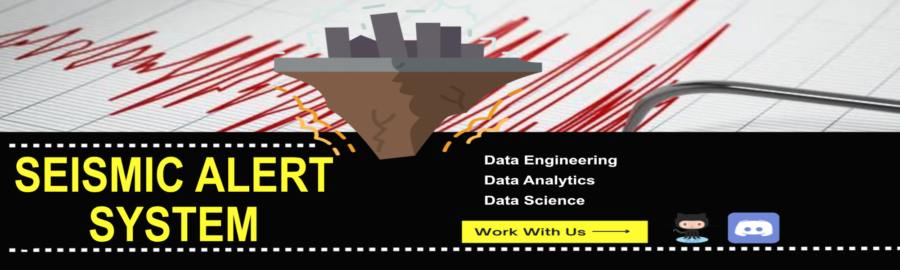
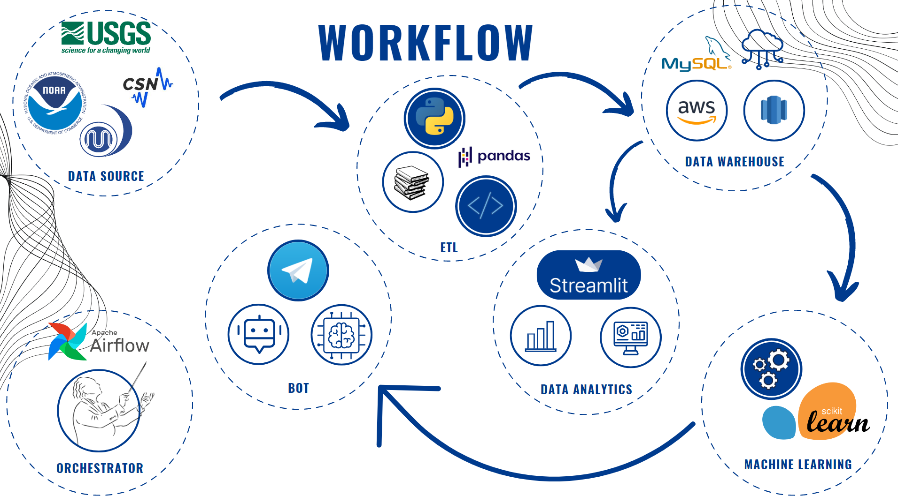
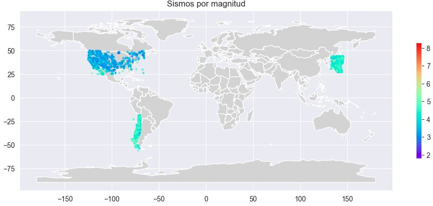
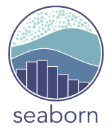

<h1 align=center>---------------------------------------------------------------------</h1>
<h1 align=center id="sistema">Seismic Alert System</h1>
<h1 align=center>---------------------------------------------------------------------</h1>

<h2> Index:</h2>

<a href="#introduction">1. Introduction</a>

<a href="#objectives">2. Objectives</a>

<a href="#data">3. Data Quality</a>

<a href="#project">4. Project Development</a>

<a href="#conclusions">5. Conclusions and Recommendations</a>

<a href="#technological">6. Technological Stack</a>

<a href="#team">7. Team Members</a>

<a href="#thank">8. Thank You</a>

<h1 align=center id="introduction">1. Introduction</h1>

<h2>Quantum Analytics</h2>

We are a consulting firm called Quantum Analytics. Using data collection and analysis of seismic movements in the United States, Japan, and Chile, our consultancy utilizes a specific machine learning model to classify seismic movements and detect patterns. By validating the accuracy of our model, we can ensure that it provides reliable results to inform citizens about potential seismic hazards. Finally, we effectively communicate these results to reach as many people as possible and contribute to public safety.

<h2>Understanding the Current Situation</h2>

Unpredictable natural events such as earthquakes claim the lives of hundreds of people when they occur. They can also cause secondary events such as tsunamis, volcano eruptions, nuclear hazards, and the condition of structures after these events is unknown. Current alerts using numbers or colors do not provide much information about secondary events or the destructiveness of an earthquake. We are faced with the need to communicate and alert the population of a region about the possibility of natural events, their destructiveness, and their consequences.

This team proposes an analysis of the situation in the last years 2018-2023 and a method of earthquake classification.

Go back to <a href="#sistema">top</a>

<h1 align=center id="objectives">2. Objectives</h1>

<h2>Scope</h2>

The scope of the project will be for the countries: Chile, United States, and Japan. Data from their respective observatories will be used. The use of external data or data from other countries is not ruled out to improve the model. The model will be a classification model.

<h2>KPIs</h2>
<ul>
  <li>KPI: Alert Response Time:
    
This measures the time it takes for the alert system to notify the people after an earthquake event occurs. This KPI helps assess the speed and efficiency of your alert.
</li>
  <li>KPI: Alert Reach:
    
Assess the percentage of the population reached by the alerts. This KPI provides insights into the coverage and penetration of the alert system and helps identify areas or demographic groups that may need additional attention.
</li>
  <li>KPI: Impact Assesment:
    
Assess the impact of earthquakes by analyzing their relationships with secondary events, such as tsunamis and volcanic hazards. This KPI can provide insights into the potential consequences. Increase accuracy and clasification quality.
</li>
</ul>

All KPIs will be measured annually.

<h2>Proposed Solution</h2>

The proposed solution is an alert API that can be implemented on various social media platforms and mobile applications. To achieve this, the following tasks are proposed.

<li>Data Engineering: Data will be extracted from different sources, transformed, and stored in the Amazon AWS cloud.

<li>Data Analytics: The stored data will be used to show the current situation with an interactive dashboard.

<li>Data science: A seismic classification model will be created using machine learning.

<h2>WorkFlow</h2>

Go back to <a href="#sistema">top</a>

<h1 align=center id="data">3. Data Quality</h1>

Data sources: 
<li>United States: &nbsp <a href='https://earthquake.usgs.gov/fdsnws/event/1/query?format=csv&starttime=2012-01-01%2000:00:00&endtime=2022-12-31%2023:59:59&maxlatitude=50&minlatitude=24.6&maxlongitude=-65&minlongitude=-125&minmagnitude=3&orderby=time-asc'>earthquake.usgs.gov/usa </a>

<li>Japan: &nbsp <a href='https://earthquake.usgs.gov/fdsnws/event/1/query?format=csv&starttime=2012-01-01%2000:00:00&endtime=2022-12-31%2023:59:59&minlatitude=27.000000&maxlatitude=44.000000&minlongitude=132.780000&maxlongitude=145.530000&&minmagnitude=3&orderby=time-asc'>earthquake.usgs.gov/japan </a>

<li>Chile: &nbsp <a href='https://earthquake.usgs.gov/fdsnws/event/1/query?format=csv&starttime=2012-01-01%2000:00:00&endtime=2022-12-31%2023:59:59&minlatitude=-56.800000&maxlatitude=-19.000000&minlongitude=-79.000000&maxlongitude=-69.900000&jsonerror=true'>earthquake.usgs.gov/chile </a>

Map of involved countries.

Go back to <a href="#sistema">top</a>

<h1 align=center id="project">4. Project Development</h1>

<h2>ETL</h2>

Explain a little about ETL

Lorem ipsum dolor sit amet, consectetur adipiscing elit. Nullam tincidunt feugiat nulla in luctus. Morbi accumsan dapibus justo, vel facilisis enim fermentum vitae. Cras dignissim bibendum metus ac fringilla. Pellentesque mollis magna viverra viverra faucibus. Pellentesque dictum sodales sapien sit amet maximus. Aliquam metus neque, vehicula at eleifend in, rutrum id turpis. Aenean ac odio efficitur sem lobortis molestie. Etiam mattis ac odio vel dignissim. Sed aliquet ante non erat mollis, eu ornare leo volutpat. Proin ac risus id risus egestas malesuada nec nec lacus.

<h2>EDA</h2>

Explain a little about EDA

Lorem ipsum dolor sit amet, consectetur adipiscing elit. Nullam tincidunt feugiat nulla in luctus. Morbi accumsan dapibus justo, vel facilisis enim fermentum vitae. Cras dignissim bibendum metus ac fringilla. Pellentesque mollis magna viverra viverra faucibus. Pellentesque dictum sodales sapien sit amet maximus. Aliquam metus neque, vehicula at eleifend in, rutrum id turpis. Aenean ac odio efficitur sem lobortis molestie. Etiam mattis ac odio vel dignissim. Sed aliquet ante non erat mollis, eu ornare leo volutpat. Proin ac risus id risus egestas malesuada nec nec lacus.

<h2>Machine Learning Model</h2>

Explain a little about the Machine Learning Model

Lorem ipsum dolor sit amet, consectetur adipiscing elit. Nullam tincidunt feugiat nulla in luctus. Morbi accumsan dapibus justo, vel facilisis enim fermentum vitae. Cras dignissim bibendum metus ac fringilla. Pellentesque mollis magna viverra viverra faucibus. Pellentesque dictum sodales sapien sit amet maximus. Aliquam metus neque, vehicula at eleifend in, rutrum id turpis. Aenean ac odio efficitur sem lobortis molestie. Etiam mattis ac odio vel dignissim. Sed aliquet ante non erat mollis, eu ornare leo volutpat. Proin ac risus id risus egestas malesuada nec nec lacus.

<h2>Visualization</h2>

Please take a look at our <a href="https://jpip8-sistema-de-aler-dataanalyticsstreamlitintroduction-d6ak17.streamlit.app/">StreamLit </a> dashboard.

Leveraging the powerful capabilities of streamlit as our core visualization tool, we have successfully generated a series of comprehensive and insightful graphs that shed light on the intricate nature of seismic activity in Japan, Chile, and the United States. These meticulously crafted visual representations serve as pivotal instruments in unraveling the complex dynamics of seismic movements, enabling us to discern patterns, trends, and potential risks with enhanced clarity. Our diligent efforts in harnessing the potential of streamlit have unlocked a wealth of previously inaccessible data, empowering us to conduct a thorough analysis of seismic phenomena. We cordially invite you to embark on an immersive journey through our detailed documentation, where we delve into the intricacies of our visualization process and its profound impact on seismic analysis.

Go back to <a href="#sistema">top</a>

<h1 align=center id="conclusions">5. Conclusions and Recommendations</h1>

Lorem ipsum dolor sit amet, consectetur adipiscing elit. Nullam tincidunt feugiat nulla in luctus. Morbi accumsan dapibus justo, vel facilisis enim fermentum vitae. Cras dignissim bibendum metus ac fringilla. Pellentesque mollis magna viverra viverra faucibus. Pellentesque dictum sodales sapien sit amet maximus. Aliquam metus neque, vehicula at eleifend in, rutrum id turpis. Aenean ac odio efficitur sem lobortis molestie. Etiam mattis ac odio vel dignissim. Sed aliquet ante non erat mollis, eu ornare leo volutpat. Proin ac risus id risus egestas malesuada nec nec lacus.

Lorem ipsum dolor sit amet, consectetur adipiscing elit. Nullam tincidunt feugiat nulla in luctus. Morbi accumsan dapibus justo, vel facilisis enim fermentum vitae. Cras dignissim bibendum metus ac fringilla. Pellentesque mollis magna viverra viverra faucibus. Pellentesque dictum sodales sapien sit amet maximus. Aliquam metus neque, vehicula at eleifend in, rutrum id turpis. Aenean ac odio efficitur sem lobortis molestie. Etiam mattis ac odio vel dignissim. Sed aliquet ante non erat mollis, eu ornare leo volutpat. Proin ac risus id risus egestas malesuada nec nec lacus.

Lorem ipsum dolor sit amet, consectetur adipiscing elit. Nullam tincidunt feugiat nulla in luctus. Morbi accumsan dapibus justo, vel facilisis enim fermentum vitae. Cras dignissim bibendum metus ac fringilla. Pellentesque mollis magna viverra viverra faucibus. Pellentesque dictum sodales sapien sit amet maximus. Aliquam metus neque, vehicula at eleifend in, rutrum id turpis. Aenean ac odio efficitur sem lobortis molestie. Etiam mattis ac odio vel dignissim. Sed aliquet ante non erat mollis, eu ornare leo volutpat. Proin ac risus id risus egestas malesuada nec nec lacus.

Go back to <a href="#sistema">top</a>

<h1 align=center id="technological">6. Technological Stack</h1>

<h3>Planning and Collaboration</h3>

 &nbsp Notion

 &nbsp Discord

 &nbsp Whatsapp

 &nbsp GitHub

<h3>Data Engineering</h3>

 &nbsp Python

 &nbsp Numpy

 &nbsp Seaborn

 &nbsp Amazon AWS

<h3>Data Analytics</h3>

 &nbsp Seaborn

 &nbsp Matplotlib

 &nbsp Streamlit

<h3>Data Science</h3>

 &nbsp Python

 &nbsp Sklearn

 &nbsp FastAPI

 &nbsp Render

Go back to <a href="#sistema">top</a>

<h1 align=center id="team">7. Team Members</h1>

<h2>Connect with Us</h2>

 Data Engineer

 Data Engineer

 Data Analyst

 Data Scientist

 Data Scientist

Go back to <a href="#sistema">top</a>
  

<h1 align=center id="thank">8. Thank You :)</h1>
<h2>Thank you for reaching this point!</h2>

 

Dear users,

 
 
 

We would like to extend our heartfelt gratitude to each and every one of you who have come across our GitHub repository. Your presence and interest mean a lot to us.

As a dedicated and passionate team, we strive to deliver high-quality projects that showcase our love for technology and our commitment to constant improvement. We not only work hard to excel in the field of data, but we also aspire to become better individuals in every aspect of our lives.

Your support and engagement motivate us to push our boundaries and explore new horizons in the world of data. We deeply appreciate your time and attention, and we hope that our projects have provided value, insights, and inspiration to you.

We believe in the power of collaboration and knowledge sharing, and we are grateful for the opportunity to connect with like-minded individuals like you through this platform. Together, we can create a community that fosters growth, innovation, and positive change.

Once again, thank you for being a part of our journey. We are honored to have you here, and we look forward to continuing this exciting adventure with you.

 
 
 

With warm regards, 
Quantum Analitycs Team

 
 
 

Go back to <a href="#sistema">top</a>
  
  
